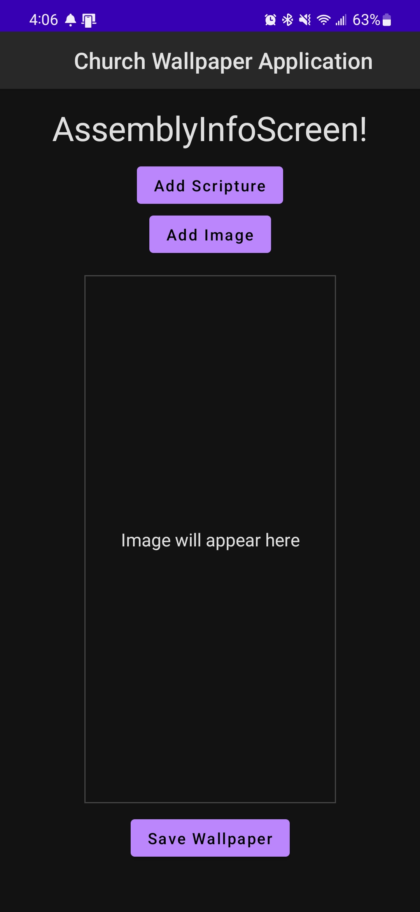
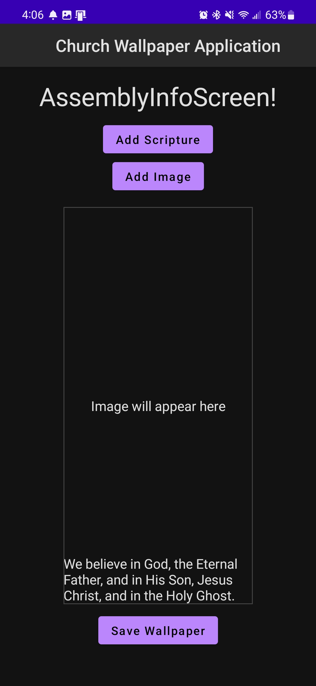

# Church Wallpaper Application

## Description

This application allows a user to overlay a scripture verse of their selection over a spiritual image. It was created using Jetpack Compose. The application utilizes SQLite to store the scripture data.

While the program is functionally complete, some images have formatting issues, and the scripture itself may blend into the background. The purpose of this project was to teach myself how to use Android Studio/Jetpack Compose, but I may add more Quality of Life and functional improvements eventually.

## Installation

Installation requires a working version of Android Studio. If you have your own phone and cable, you do not need to install an emulator. Otherwise, go ahead and install one while installing Android Studio.

With Android Studio open, click `File-> New-> Project from Version Control`.

In the URL field, input the URL of the page you're currently viewing and select `Clone`.

You're done! Note that first time installation takes a considerable amount of time, so please be patient as it initializes.

## How To Run

If you want to run on your own device, you may connect it via USB cable. Ensure that developer tools are enabled. A tutorial on how to do that may be found [here.](https://www.samsung.com/us/support/answer/ANS00087642/) Select your newly connected device at the top (next to the play button!) or select your emulator, if you're using that.

Finally, push the play button! The app should open automatically.

## Navigation

Press 'Begin' to open the assembly info screen, featured here:

This is where your selected scripture and image will be displayed. From here, you can add either an image or a scripture.
If you add a scripture first, you'll navigate through volumes, books, chapters, and verses. Select a verse, and the assembly info screen will update to look something like this:

Lastly, we can add an image. Select one from the list to see a result similar to this:

Now that we have both an image and a scripture, we can tap our `Save Wallpaper` button. There's currently no feedback for it, but if you check your images, you'll see that it did indeed save.

 
 
 
 

This application is not to be used commercially without express permission of the owner (Github user: RealLifeDunnce).

